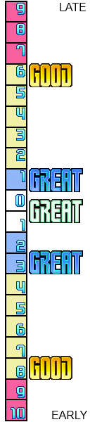

# Beatmania .1 format

This document serves to explain the .1 format used by Konami's Beatmania
IIDX arcade series of games.

## About this format

Beatmania charts have been stored in a few different formats over the lifetime
of the franchise. The .1 format is the latest format in use today. It was first
discovered in 9th Style AC.

## In a nutshell

The .1 file format is actually a kind of 'chart archive'. The file is two parts:
the first part is the directory and the second part is where all the actual data is
stored. The directory tells us which difficulties are available and where they
are in the file.

## Directory

There are 12 directory entries. Each entry is 8 bytes long:

```
Offset(h) Type      Length    Descrption
+00       int32     4         offset of the chart from the beginning of the file
+04       int32     4         length of the chart, in bytes
```

The charts are stored immediately after the directory typically. Although
it is quite possible at a later date Konami will add more charts to the directory,
so don't assume this.

## Chart

Charts are stored as a series of 8-byte events. Each event has an offset, a type,
and some parameters. The end of the chart is determined by the "end of chart"
offset value of 0x7FFFFFFF. This means each chart needs to end with the byte sequence
`FF FF FF 7F 00 00 00 00`. Values are little-endian.

```
Offset(h) Type      Length    Descrption
+00       int32     4         offset of the event, in ticks
+04       byte      1         type of event
+05       byte      1         event-specific parameter
+06       int16     2         event-specific value
```

### Tick Timing

In the arcade versions of Beatmania IIDX, there is no "tick rate" defined in
the chart file itself. You have to infer it from the version of the game:

```
Version        Ticks Per Second
Before GOLD    59.94
GOLD           60.046
After GOLD     1000
```

You'll notice precision of the notes greatly increases on TROOPERS and later.
All you have to do is `EventTickOffset / TicksPerSecond` and you will have
the offset of the event in seconds.

### Event Types

```
Value(h)  Description
00        Visible note on the playfield for player 1
01        Visible note on the playfield for player 2
02        Sample change for player 1
03        Sample change for player 2
04        Tempo change
05        Meter information
06        End of song
07        BGM sound
08        Timing window information
0C        Measure bar
10        Note count information
```

#### Visible Note (00, 01)

- Type: 00 (Player 1), 01 (Player 2)
- Parameter: Column number
- Value: If nonzero, defines the length of a freeze note in ticks

If the value is zero, it's just a regular note.

#### Sample Change (02, 03)

- Type: 02 (Player 1), 03 (Player 2)
- Parameter: Column number
- Value: Number of the sample to set the column to

This is what determines which sound will play when a key is pressed,
but does not actually make a sound by itself.

#### Tempo Change (04)

- Type: 04
- Parameter: Denominator
- Value: Numerator

The BPM is a fraction determined by Numerator/Denominator. Songs can
be found that have either 1 or 100 for the denominator, depending
if a fractional BPM is used. A Parameter of 00 is NOT valid.

#### Meter Information (05)

- Type: 05
- Parameter: Denominator
- Value: Numerator

This tells the game how to count beats. Most songs are 4/4 meter, but
songs such as Holic and Abstract would be in 7/8 part of the time.
If I had to guess, it's used for the flashing graphic in the background
of the play field for synchronizing with beats.

#### End of Song (06)

- Type: 06

This just marks the end of the song. I think when this event is
encountered, it signals to the game engine that it should fade
out and go to grading.

#### BGM Sound (07)

- Type: 07
- Parameter: Stereo panning (01-0F, left to right, 08 is center)
- Value: Sound number to play

This event just plays a sound in the background and is not visible
on the field.

#### Timing Window Information

- Type: 08
- Parameter: Which part of the window to define
- Value: Frame count

The frame count is an 8-bit signed value and is counted in the number
of frames *ahead* of the note a player presses. JUST GREAT is implicitly
a window of 0 and 1. That means values below 0 are late, and values above
0 are early.

A lot of good information about this type can be found here:
https://zenius-i-vanisher.com/v5.2/viewthread.php?threadid=5233

Here's the list of parameters:
```
Value(h)  Description
00        latest end of the judgement window
01        latest end of the GOOD window
02        latest end of the GREAT window
03        earliest end of the GREAT window
04        earliest end of the GOOD window
05        earliest end of the judgement window
```

Here's a visual representation of values -16, -6, -1, 3, 8, 18 courtesy of
Catastrophe from the above link:



In some double charts, these values are included twice. It is not known at
this time whether this has an effect on gameplay.

#### Measure Bar

- Type: 0C
- Parameter: Which player it is visible for

This is just a visual element, rendered as a measure bar across the
play field.

#### Note Count Information

- Type: 10
- Parameter: Which player it is a count for
- Value: Number of playable notes

This just indicates how many playable notes there are in the chart.

### Columns

In IIDX, this is the column mapping:

```
Value(h)  Description
00        Key 1
01        Key 2
02        Key 3
03        Key 4
04        Key 5
05        Key 6
06        Key 7
07        Scratch
```